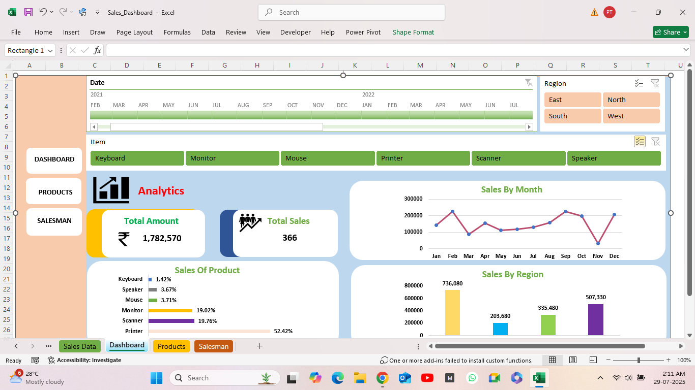
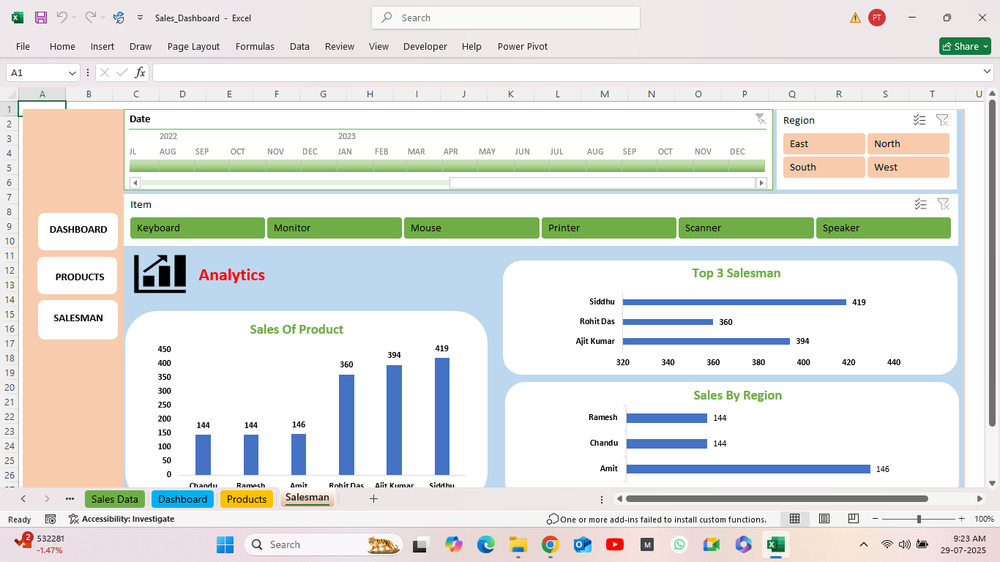
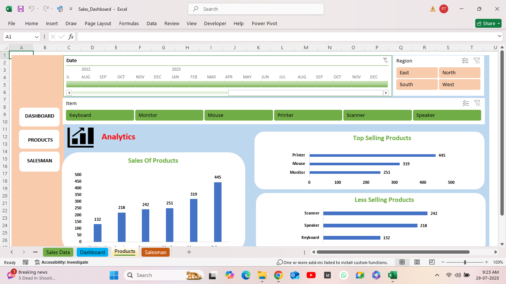

# Excel-sales-dashboard
Interactive Excel dashboard with filters and visual analytics

## Dashboard Tabs

| Tab Name     | Description                                                                 |
|--------------|-----------------------------------------------------------------------------|
| `Dashboard`  | Summary view: total amount, total sales,Products wise distribution, monthly and regional trends |
| `Salesman`   | Top 3 salesmen + Bottom 3 Sales man+salesman-wise contribution (using by Quantity)   |                               
| `Products`   | Top 3 & less 3 selling products, product-wise contribution  (using by Quantity)  |  

##Files Included

| File                          | Description                      |
|-------------------------------|----------------------------------|
| `Sales_Dashboard.xlsx`        | Main Excel dashboard file        |
| `screenshot_Dashboard.png`    | Dashboard view preview           |
| `screenshot_Salesman.png`     | Salesman analysis preview        |
| `screenshot_Products.png`     | Product-wise sales preview       |

## 📷Screenshots

### Dashboard Tab  

### Salesman Tab  

###  Product Tab  

#  Highlights

- Excel slicers for interactive filtering (Date, Region, Product)
- Pivot tables & charts
- Clean UI with navigation buttons
- Great for showcasing Excel analytics skills

## How to Use
- Download the `.xlsx` file
- Open in Excel (2016 or later recommended)
- Use filters at the top to explore
